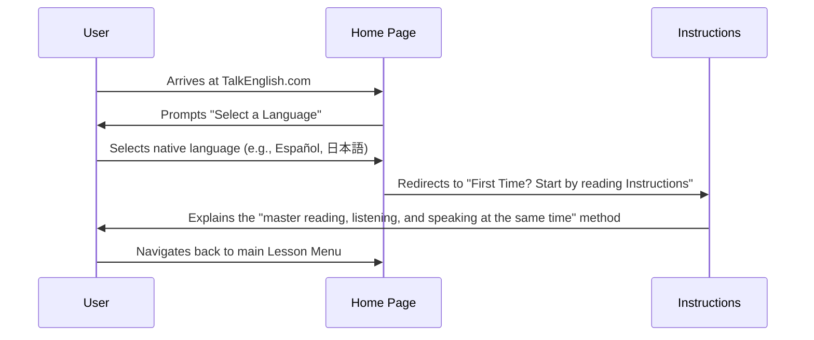
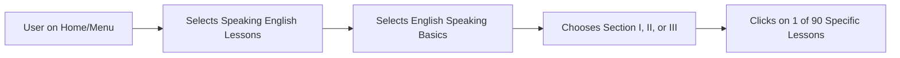
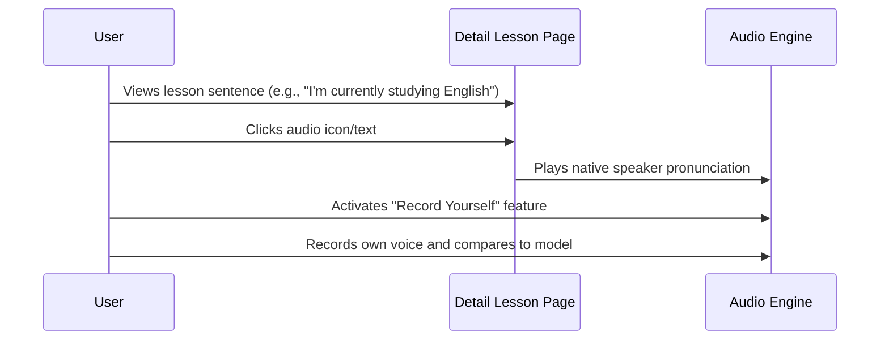
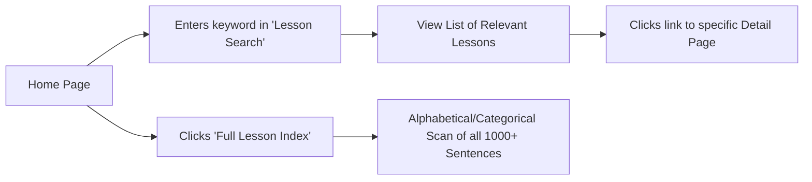

# TalkEnglish - Complete Product Specification

> **Generated:** 2026-06-22  
> **Source:** TalkEnglish NotebookLM (Notebook ID: `8ed35ac6-1a09-43ca-8ccd-dd7e327c9be5`)  
> **Sources Used:** Home Page, Menu Page, Detail Page, English Grammar in Use (5th Ed.), 1000 Daily Use Sentences PDF

---

## Table of Contents

1. [Product Requirements Document (PRD)](#1-product-requirements-document-prd)
2. [Sitemap](#2-sitemap)
3. [User Flow](#3-user-flow)
4. [Wireframe](#4-wireframe)
5. [Style Guide](#5-style-guide)
6. [API Specification](#6-api-specification)
7. [Coding Standards](#7-coding-standards)

---

# 1. Product Requirements Document (PRD)

## 1.1 Project Overview and Goals
The objective is to build a comprehensive English learning platform modeled after **TalkEnglish.com**. The platform's primary goal is to help users "Learn English speaking so you can speak English fluently."

**Key Goals:**
- **Integrated Learning:** Provide a structure where users practice reading, listening, and speaking simultaneously to achieve fluency.
- **Accessibility:** Offer high-quality English education for free, accessible via web, mobile apps, and offline versions.
- **Comprehensive Curriculum:** Host a vast library of lessons ranging from "English Speaking Basics" to "Business English" and "Advanced Listening".

---

## 1.2 Target Users
The platform serves a global audience of English learners across various proficiency levels:
- **Beginners:** Users who need help with basic phrases and expressions to understand the fundamentals of speaking.
- **Intermediate Learners:** Students who have mastered basics but struggle with complex structures, such as those found in *English Grammar in Use* (e.g., present perfect continuous, modals, and relative clauses).
- **Business Professionals:** Individuals looking to improve fluency in office settings, prepare for interviews, or master professional idioms.
- **Travelers:** Users needing situational English for navigation, tickets, and local interactions.

---

## 1.3 Core Features and Functionality
- **Lesson Search:** A robust search tool to find specific grammar points or situational phrases.
- **Audio-Visual Integration:**
  - **Audio Files:** Every phrase or sentence in beginner lessons must include a clickable audio file (e.g., 900+ audio files for the 90 Speaking Basics lessons).
  - **Video Lessons:** Dedicated sections for conversation, business, and general speaking videos.
  - **Record Yourself:** A feature to allow users to compare their own pronunciation against native models.
- **Interactive Exercises:**
  - Self-study grammar practice with a "Key to Exercises" for immediate feedback.
  - Study guides to help users identify which units they need to focus on.
- **Multilingual Support:** Instructions and navigation available in 20+ languages, including Spanish, French, Chinese, and Arabic.
- **Offline Functionality:** Ability to download "Offline Versions" for computers and mobile devices.
- **Resource Library:** Downloadable PDFs (e.g., "1000 Daily Use Sentences") and interactive ebooks.

---

## 1.4 Content Structure
The content is organized into logical tracks to guide users from absolute beginner to advanced proficiency:

### English Lessons Hierarchy
1. **Speaking English Lessons:**
   - **English Speaking Basics:** 90 lessons using simple phrases (e.g., usage of "I'm," "I have," "I'm gonna")
   - **Regular English Lessons:** Daily conversation skills
   - **Business English:** Office settings and professional vocabulary
   - **Interview English:** Confidence building for English-led interviews
   - **Travel English:** Essential phrases for navigation and services
   - **Idioms and Phrases:** Expressions that are difficult to translate literally
2. **Listening Lessons:** Categorized into Basic, Intermediate, and Advanced levels
3. **Extra Lessons:** Focus on Pronunciation, Grammar Basics, and ESL Vocabulary

### Grammar Framework (145 Units)
The grammar section follows the systematic structure of *English Grammar in Use*, organized by grammatical category:
- **Tenses:** Present and Past (Units 1–6), Present Perfect and Past (Units 7–14), Future (Units 19–25)
- **Modals:** Can, Could, Must, May, Might, Should (Units 26–37)
- **Structure:** Passive voice (Units 42–46), Reported Speech (Units 47–48), Conditionals (Units 38–40)
- **Pronouns & Determiners** (Units 82-91)
- **Relative Clauses** (Units 92-97)
- **Adjectives & Adverbs** (Units 98-111)
- **Phrasal Verbs** (Units 137-145)

### Daily Use Sentences
Thematic modules featuring 1,000 sentences such as:
- **Self-Introduction:** "My name is Daniel," "I work as a teacher"
- **Situational:** Asking for help, finding a bank, ordering dinner, and checking meeting times
- **Abstract:** Expressing opinions, making suggestions, and asking for advice

---

## 1.5 Technical Requirements
- **Cross-Platform Capability:** Native apps for Android and iOS alongside a responsive web version.
- **Audio Management:** High-performance audio streaming engine for instantaneous playback of phrase-specific audio files.
- **Offline Storage:** Secure local storage for "Offline Version" downloads on Windows and mobile OS.
- **Progress Tracking:** Database to track user progress through the 145 grammar units and 90 basic speaking lessons.
- **Search Engine:** Indexing of "Full Lesson Index" for rapid keyword retrieval.

---

## 1.6 Success Metrics
- **User Fluency improvement:** Measured by completion rates of the "5 Rules for Speaking Fluency" curriculum.
- **Engagement:** Average time spent on "Interactive Ebooks" and lesson pages.
- **Acquisition:** Number of "Offline Version" and mobile app downloads.
- **Comprehension:** Score improvements in the grammar "Study Guide" and exercise completion.
- **Global Reach:** Geographic distribution of users accessing instructions in non-English languages.

---

# 2. Sitemap

## 2.1 Sitemap Hierarchy

```mermaid
graph TD
    Home[Home Page] --> Lang[Language Selection: 20+ Languages]
    Home --> FirstTime[Instructions for First Time Users]
    
    Home --> EngLessons[English Lessons]
    
    EngLessons --> Speaking[Speaking English Lessons]
    Speaking --> Basics[English Speaking Basics: I, II, III]
    Speaking --> Regular[Regular English Lessons]
    Speaking --> Business[Business English Lessons]
    Speaking --> Interview[Interview English Lessons]
    Speaking --> Travel[Travel English Lessons]
    Speaking --> Idioms[Idioms and Phrases]
    
    EngLessons --> Video[English Video Lessons]
    Video --> ConvVid[Conversation Videos]
    Video --> BusVid[Business English Videos]
    Video --> SpeakVid[English Speaking Videos]
    
    EngLessons --> Listening[English Listening Lessons]
    Listening --> LBasic[Basic]
    Listening --> LInter[Intermediate]
    Listening --> LAdv[Advanced]
    
    EngLessons --> Extra[Extra English Lessons]
    Extra --> Pron[Pronunciation]
    Extra --> Grammar[English Grammar Basics]
    Extra --> Vocab[English Vocabulary / ESL]
    
    Home --> Extras[Extras]
    Extras --> Articles[English Speaking Articles]
    Articles --> Rules[5 Rules for Speaking Fluency]
    Articles --> Study[Study Method / Intonation]
    
    Home --> Offline[Download Offline Version]
    Offline --> Comp[Computer Version]
    Offline --> Mobile[Android / iOS Apps]
    
    Home --> Index[Full Lesson Index]
    Home --> Search[Lesson Search Tool]
```



---

# 3. User Flow

## 3.1 New User First Visit & Orientation



## 3.2 Browsing and Selecting a Lesson



## 3.3 Completing a Grammar Exercise

```mermaid
graph TD
    Unit[User opens Grammar Unit] --> Theory[Reads Explanation & Examples]
    Theory --> Task[Navigates to Exercises Section]
    Task --> Practice[Completes "Fill in the blank" or "Word Order" tasks]
    Practice --> Check[Consults "Key to Exercises" for Answers]
    Check --> Review[Re-reads Explanation if errors occur]
```

## 3.4 Using Audio & "Record Yourself" Features



## 3.5 Searching for Specific Content



---

# 4. Wireframe

## 4.1 Home Page Wireframe

```
_______________________________________________________________________________
| [TALKENGLISH.COM LOGO]                          [Select Language v] [Search] |
|______________________________________________________________________________|
|  [Speaking]  [Video]  [Listening]  [Extra Lessons]  [Offline]  [Full Index]  |
|______________________________________________________________________________|
|                                                                              |
|      HERO SECTION: "Learn English speaking FREE with TalkEnglish.com"        |
|      "Our goal is to help you speak English fluently. Improve for free!"     |
|      [Start by reading Instructions for First-Time Users]                    |
|______________________________________________________________________________|
|                                                                              |
|  FEATURED LESSONS GRID                                                       |
|  __________________________    __________________________                    |
| | Speaking Basics          |  | Regular English Lessons  |                   |
| | 90 lessons for beginners |  | Daily conversations      |                   |
| |__________________________|  |__________________________|                   |
|                                                                              |
|  __________________________    __________________________                    |
| | Business English         |  | Interview English        |                   |
| | Office & professional    |  | Prepare for job calls    |                   |
| |__________________________|  |__________________________|                   |
|                                                                              |
|  __________________________    __________________________                    |
| | English Listening        |  | Idioms and Phrases       |                   |
| | Basic/Inter/Advanced     |  | Hard to translate terms  |                   |
| |__________________________|  |__________________________|                   |
|______________________________________________________________________________|
|                                                                              |
|  EXTRAS SECTION                                                              |
|  [5 Rules for Fluency]  [English Vocabulary]  [Study Method]  [Offline App]  |
|______________________________________________________________________________|
|                                                                              |
|  FOOTER: COPYRIGHT 2005-2023 | TERMS | CONTACT | PRIVACY | FAQs              |
|______________________________________________________________________________|
```

## 4.2 Menu Page Wireframe

```
_______________________________________________________________________________
| [LOGO]                                                          [SEARCH]     |
|______________________________________________________________________________|
|                                                                              |
| SIDEBAR NAVIGATION (LEFT)       | MAIN CONTENT AREA (RIGHT)                  |
|                                 |                                            |
| ENGLISH LESSONS                 | BREADCRUMBS: Home > Speaking > Basics      |
| |- Speaking English             |                                            |
|    |- Speaking Basics [I,II,III]| TITLE: "English Speaking Basics"           |
|    |- Regular Lessons           |                                            |
|    |- Business English          | DESCRIPTION: "This section is for beginners|
|    |- Interview English         | using very simple phrases. There are 90    |
|    |- Travel English            | lessons with 900+ audio files."            |
| |- Video Lessons                |                                            |
| |- Listening Lessons            | _________________________________________  |
| |- Extra Lessons                | | [SECTION I: Lessons 1-30]             |  |
|                                 | | - Lesson 1: Usage of "I'm"            |  |
| EXTRAS                          | | - Lesson 2: Usage of "I have"         |  |
| |- 5 Rules for Fluency          | | - Lesson 3: Usage of "I'm gonna"      |  |
| |- Study Method                 | |_______________________________________|  |
| |- Download Offline             |                                            |
| |- Android & iOS Apps           | _________________________________________  |
|                                 | | [SECTION II: Lessons 31-60]           |  |
|                                 | | [SECTION III: Lessons 61-90]          |  |
|_________________________________|____________________________________________|
```

## 4.3 Detail Lesson Page Wireframe

```
_______________________________________________________________________________
| [LOGO]                                                          [SEARCH]     |
|______________________________________________________________________________|
|                                                                              |
| TITLE: "English Speaking Basics - Section I - Lesson 1"                      |
|                                                                              |
| ____________________________________________________________________________ |
| | LESSON CONTENT AREA                                                      | |
| | "Listen to each sentence and repeat it."                                 | |
| |                                                                          | |
| | 1. "I am very happy to meet you."        [▶ PLAY]                        | |
| | 2. "I recently moved to this area."      [▶ PLAY]                        | |
| | 3. "I work as a teacher."                [▶ PLAY]                        | |
| |__________________________________________________________________________| |
|                                                                              |
| ____________________________________________________________________________ |
| | AUDIO PLAYER CONTROLS                                                    | |
| | [ ⏮ ] [ ▶ PLAY ALL ] [ ⏭ ]                 [🔊 Volume]                   | |
| |__________________________________________________________________________| |
|                                                                              |
| ____________________________________________________________________________ |
| | RECORD YOURSELF SECTION                                                  | |
| | 1. Click 'Record' and speak into your mic.                               | |
| | 2. Click 'Stop' and 'Play' to hear your version.                         | |
| | 3. Compare with the Native Model above.                                  | |
| | [ 🔴 RECORD ] [ ⏹ STOP ] [ ▶ PLAYBACK ]                                  | |
| |__________________________________________________________________________| |
|                                                                              |
| ____________________________________________________________________________ |
| | NAVIGATION                                                               | |
| | [ ← Previous Lesson ]                   [ Next Lesson → ]                | |
| |__________________________________________________________________________| |
|______________________________________________________________________________|
```

---

# 5. Style Guide

## 5.1 Color Palette

| Token | Hex Code | Usage |
|-------|----------|-------|
| **Primary Navy** | `#1A3A6C` | Primary headers, navigation bars, unit markers |
| **Secondary Blue** | `#3498DB` | Hyperlinks and secondary navigation items |
| **Educational Yellow** | `#FFD700` | Grammar "Study Guide" highlights, key section accents |
| **Background Neutral** | `#FFFFFF` | Main background for high contrast readability |
| **Text Primary** | `#212529` | Deep grey body text to reduce eye strain |
| **Success Green** | `#27AE60` | "Key to Exercises" correct answer feedback |

## 5.2 Typography

| Token | Size | Weight | Color | Usage |
|-------|------|--------|-------|-------|
| **Hero Headings (H3)** | 24pt / 32px | Bold | `#1A3A6C` | Main category titles |
| **Section Headings (H4/H5)** | 18pt / 24px | Semi-bold | `#1A3A6C` | Sub-categories and lesson groupings |
| **Body Copy** | 16px | Regular | `#212529` | Standard text for daily use sentences |
| **Lesson Indices** | 14px | Regular | `#3498DB` | "Full Lesson Index" sidebar items |

**Font Family:** Sans-serif (Roboto / Open Sans) — clean, modern, globally accessible.

## 5.3 Button Styles

| Button Type | Style | Usage |
|-------------|-------|-------|
| **Primary CTA** | Solid Navy (`#1A3A6C`), White text, 4px rounded | "Start Instructions", "Download Offline Version" |
| **Secondary / Outline** | Transparent, Navy border | "Discover More" links |
| **Audio Play Button** | Circular icon with "Play" triangle (▶) | Adjacent to every practice sentence |
| **Language Selector** | Dropdown/list, high-contrast text | 20+ language selection |

## 5.4 Iconography

| Icon | Meaning |
|------|---------|
| 🔊 Speaker | Audio playback for 900+ audio files |
| ✅ Checkmark | Answer Key for grammar exercises |
| 💻📱 Device Icons | Computer, Android, iPhone for download sections |
| ⬅➡ Directional Arrows | Navigation between units ("Previous" and "Next") |

## 5.5 Spacing and Layout System

- **Unit Layout:** "Facing pages" principle — left side for explanations/examples, right side for interactive exercises
- **Sidebar Navigation:** Consistent left-hand sidebar for "Full Lesson Index"
- **Gutter Spacing:** 24px between lesson cards, 16px between list items

## 5.6 Card Components

- **Lesson Category Cards:** White background, subtle border, bottom-aligned descriptive text
- **Popular Feature Cards:** Bordered boxes for "5 Rules for Fluency" and "English Vocabulary"

## 5.7 Form Elements

- **Lesson Search Tool:** Prominent input field, 1px border, magnifying glass icon
- **Exercise Inputs:** Underlined or boxed fields within grammar units

## 5.8 Responsive Breakpoints

| Device | Range | Notes |
|--------|-------|-------|
| **Desktop** | ≥ 1024px | Multi-column views, "Computer Version" |
| **Tablet** | 768px – 1023px | "iPad/iPhone Version" interactive ebooks |
| **Mobile** | 320px – 767px | Simplified single-column sentence lists, native apps |

---

# 6. API Specification

## 6.1 Data Models

### Category
```json
{
  "id": "uuid",
  "title": "Speaking English Lessons",
  "slug": "speaking-english-basics",
  "description": "Basics of English speaking for beginners using common expressions.",
  "parent_id": null,
  "lesson_count": 90
}
```

### Lesson
```json
{
  "id": "uuid",
  "category_id": "uuid",
  "title": "Basic usage of 'I'm'",
  "section": "Section I",
  "level": "Beginner",
  "sentences": [
    {
      "text": "I'm so tired.",
      "audio_url": "https://api.talkenglish.com/audio/basics/1_1.mp3",
      "translation": "Estoy muy cansado"
    }
  ]
}
```

### Grammar Unit
```json
{
  "unit_number": 2,
  "title": "Present simple (I do)",
  "explanation": "We use the present simple to talk about things in general.",
  "examples": ["Nurses look after patients in hospitals.", "The earth goes round the sun."],
  "exercises": [
    {
      "id": "ex_2_1",
      "instruction": "Complete the sentences using the following verbs:",
      "question": "Tanya ___ German very well.",
      "answer": "speaks"
    }
  ]
}
```

### User & UserProgress
```json
{
  "user_id": "uuid",
  "email": "student@example.com",
  "native_language": "Español",
  "progress": {
    "completed_lessons": ["uuid1", "uuid2"],
    "completed_grammar_units": [1, 2, 3],
    "last_accessed": "2026-06-22T08:43:00Z"
  }
}
```

## 6.2 Authentication Endpoints

| Method | Endpoint | Description |
|--------|----------|-------------|
| `POST` | `/auth/register` | Create a new account with native language preference |
| `POST` | `/auth/login` | Returns a JWT and user profile |
| `POST` | `/auth/logout` | Invalidate the current session |

## 6.3 Content Endpoints

### Categories & Lessons
| Method | Endpoint | Description |
|--------|----------|-------------|
| `GET` | `/categories` | Returns the hierarchy of lessons (Speaking, Video, Listening, Extra) |
| `GET` | `/categories/:id/lessons` | Returns all lessons within a sub-category (e.g., 90 Speaking Basics) |
| `GET` | `/lessons/:id` | Returns detailed lesson content with sentences and audio URLs |

### Grammar
| Method | Endpoint | Description |
|--------|----------|-------------|
| `GET` | `/grammar` | Returns full list of 145 units grouped by category |
| `GET` | `/grammar/:unit_number` | Returns specific unit's explanation, examples, and exercises |
| `POST` | `/grammar/:unit_number/exercises/check` | Submit answers for grading |

**Check Request:**
```json
{
  "answers": [{"id": "ex_2_1", "value": "speaks"}]
}
```

**Check Response:**
```json
{
  "score": "1/1",
  "results": [{"id": "ex_2_1", "correct": true}]
}
```

### Search
| Method | Endpoint | Description |
|--------|----------|-------------|
| `GET` | `/search?q={query}` | Searches "Full Lesson Index" and "1000 Daily Use Sentences" |

## 6.4 Audio Endpoints

| Method | Endpoint | Description |
|--------|----------|-------------|
| `GET` | `/audio/:category/:filename` | Serves high-quality mp3 files (e.g., 900+ Speaking Basics files) |
| `POST` | `/practice/record` | Upload user's recorded clip (multipart form-data: audio + sentence_id) |

## 6.5 User Progress Endpoints

| Method | Endpoint | Description |
|--------|----------|-------------|
| `GET` | `/users/me/progress` | Returns student's current standing in curriculum |
| `POST` | `/users/me/progress/:content_type/:id` | Update lesson or grammar unit status |

## 6.6 Error Handling Format

All errors follow RFC 7807 standard:

```json
{
  "error": {
    "code": "resource_not_found",
    "message": "Grammar Unit 146 does not exist. Please refer to the Study Guide for valid units.",
    "details": {
      "requested_unit": 146,
      "max_unit": 145
    }
  }
}
```

## 6.7 Technical Considerations

- **Localization:** Support `Accept-Language` header for multi-language instructions
- **Caching:** Static lesson content and search results should be cached aggressively
- **Offline Sync:** Bulk download endpoint `GET /content/bundle` for offline versions
- **Audio Streaming:** On-demand streaming to manage 900+ file overhead

---

# 7. Coding Standards

## 7.1 Project Structure Conventions

The project follows a **feature-based modular architecture** for Angular:

```
src/
├── app/
│   ├── core/                    # Singleton services (AuthService, LanguageService)
│   ├── shared/                  # Reusable components (AudioPlayerComponent, SearchInputComponent)
│   ├── features/
│   │   ├── speaking/            # SpeakingModule: Basics, Business, Interview
│   │   ├── grammar/             # GrammarModule: 145 interactive units
│   │   ├── listening/           # ListeningModule: Basic, Intermediate, Advanced
│   │   └── offline/             # OfflineModule: Download logic
│   └── ...
```

## 7.2 TypeScript Naming Conventions

| Element | Convention | Example |
|---------|------------|---------|
| **Files** | kebab-case | `speaking-basics-list.component.ts` |
| **Classes/Interfaces** | PascalCase (no "I" prefix) | `Lesson`, `GrammarUnit`, `DailySentence` |
| **Variables/Functions** | camelCase | `playSentenceAudio()`, `currentLesson` |
| **Constants** | UPPER_SNAKE_CASE | `MAX_LESSONS_SECTION_1 = 30` |

## 7.3 Angular Component Architecture

Utilize the **Smart/Dumb component pattern**:

- **Smart Components (Containers):** Manage state and data fetching. E.g., `GrammarUnitContainer` fetches unit explanations and exercises based on URL parameters.
- **Dumb Components (Presentational):** Focus on UI. `SentenceListComponent` receives sentences via `@Input()` and emits `@Output()` when "Play" is clicked.
- **Integrated practice:** Components must support simultaneous display of text, audio controls, and recording triggers.

## 7.4 State Management Approach

- **Services with BehaviorSubjects:** For UI state (selected language, audio playback status)
- **LocalStorage:** Track progress through "Full Lesson Index" and grammar "Study Guide"
- **Lazy Loading:** Every major feature (Speaking, Video, Listening) loaded on demand

## 7.5 Code Formatting

**Prettier Config:**
```json
{
  "semi": true,
  "trailingComma": "all",
  "singleQuote": true,
  "printWidth": 100,
  "tabWidth": 2
}
```

**ESLint Rules:**
- Standard Angular rules enforced
- Strict `@typescript-eslint/no-explicit-any: error`
- `@angular-eslint/component-selector`: prefix `app-`, kebab-case

## 7.6 Git Workflow and Commit Conventions

Use **Conventional Commits**:

```bash
feat(grammar): add present perfect unit exercises
fix(audio): resolve playback issue in Speaking Basics
docs(i18n): update Vietnamese translation for instructions
style(lessons): adjust card spacing on menu page
perf(speaking): lazy load audio files for Basics section
test(grammar): add unit tests for ExerciseEvaluator
```

| Scope | Usage |
|-------|-------|
| `grammar` | Grammar units and interactive exercises |
| `audio` | Audio playback features |
| `speaking` | Speaking lesson content |
| `i18n` | Multi-language instructions |
| `offline` | Download/offline features |

## 7.7 Testing Standards

- **Unit Tests (Jasmine/Karma):** Required for logic-heavy services like `ExerciseEvaluator` (checks answers against "Answer Key")
- **Integration Tests:** Ensure clicking a sentence triggers the correct audio URL
- **E2E Tests (Cypress):** Validate critical paths: "Language Selection → Lesson Browsing → Exercise Completion"

## 7.8 Performance Optimization

- **Lazy Loading:** All feature modules load on demand
- **Audio Optimization:** Stream on-demand, don't pre-load 900+ files
- **Change Detection:** `ChangeDetectionStrategy.OnPush` for static content (e.g., "1000 Daily Use Sentences")
- **Image Optimization:** Use WebP format with lazy loading

## 7.9 Accessibility (a11y) Standards

- **Aria-Labels:** Every audio play button must have a descriptive label (e.g., "Play audio for: I'm so tired")
- **Keyboard Navigation:** All interactive grammar exercises must be completable without a mouse
- **Language Support:** `lang` attribute must update dynamically on language selection
- **WCAG 2.1 AA:** Minimum contrast ratio 4.5:1 for text, 3:1 for large text
- **Screen Readers:** All icons must have `aria-label` or be hidden with `aria-hidden`

## 7.10 Documentation Standards

- **JSDoc:** Required for all public methods in services (recording logic, progress tracking)
- **README per Module:** Each feature module includes a `README.md` explaining content hierarchy
- **API Documentation:** Use OpenAPI/Swagger for all endpoints
- **Component Documentation:** Use Storybook for shared UI components

---

## 8.0 Branding and Identity

- **Website Logo:** The logo should be a text-based mark featuring the text **"TALKENGLISH.COM"**. It is positioned in the top-left corner of the header.
- **Brand Colors:** The logo uses **Primary Navy (#1A3A6C)** or white when placed on a Navy background, to maintain a professional and educational feel.
- **Site Icon (Favicon):** The website utilizes a circular "Play" triangle icon (with Navy Blue background and white triangle) to represent the platform's reliance on audio and integrated learning.

---

## Appendix

### Source References
This document was generated by querying the TalkEnglish NotebookLM notebook containing the following sources:

| # | Source | Type |
|---|--------|------|
| 1 | Home Page \| TalkEnglish | Web Page |
| 2 | Menu Page \| TalkEnglish | Web Page |
| 3 | Detail Page \| TalkEnglish | Web Page |
| 4 | English Grammar in Use (Intermediate, 5th Ed.) | PDF |
| 5 | Daily-Use-Sentences-PDF.pdf | PDF |

### Version History

| Date | Version | Description |
|------|---------|-------------|
| 2026-06-22 | 1.0.0 | Initial specification generated from NotebookLM |
