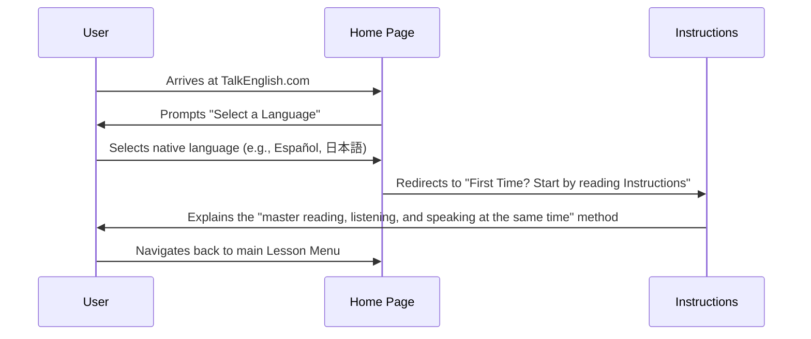
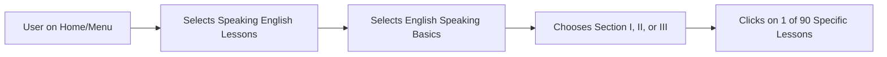
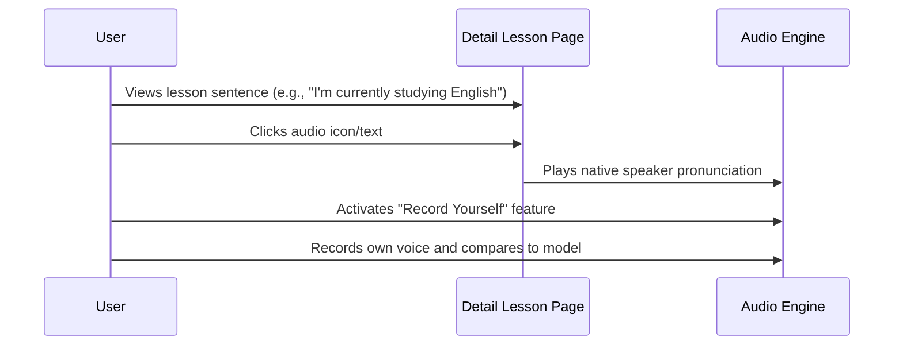
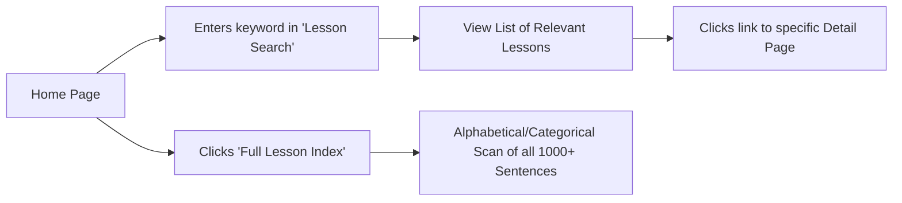

# 2. Sitemap

## 2.1 Sitemap Hierarchy

```mermaid
graph TD
    Home[Home Page] --> Lang[Language Selection: 20+ Languages]
    Home --> FirstTime[Instructions for First Time Users]
    
    Home --> EngLessons[English Lessons]
    
    EngLessons --> Speaking[Speaking English Lessons]
    Speaking --> Basics[English Speaking Basics: I, II, III]
    Speaking --> Regular[Regular English Lessons]
    Speaking --> Business[Business English Lessons]
    Speaking --> Interview[Interview English Lessons]
    Speaking --> Travel[Travel English Lessons]
    Speaking --> Idioms[Idioms and Phrases]
    
    EngLessons --> Video[English Video Lessons]
    Video --> ConvVid[Conversation Videos]
    Video --> BusVid[Business English Videos]
    Video --> SpeakVid[English Speaking Videos]
    
    EngLessons --> Listening[English Listening Lessons]
    Listening --> LBasic[Basic]
    Listening --> LInter[Intermediate]
    Listening --> LAdv[Advanced]
    
    EngLessons --> Extra[Extra English Lessons]
    Extra --> Pron[Pronunciation]
    Extra --> Grammar[English Grammar Basics]
    Extra --> Vocab[English Vocabulary / ESL]
    
    Home --> Extras[Extras]
    Extras --> Articles[English Speaking Articles]
    Articles --> Rules[5 Rules for Speaking Fluency]
    Articles --> Study[Study Method / Intonation]
    
    Home --> Offline[Download Offline Version]
    Offline --> Comp[Computer Version]
    Offline --> Mobile[Android / iOS Apps]
    
    Home --> Index[Full Lesson Index]
    Home --> Search[Lesson Search Tool]
```



---

# 3. User Flow

## 3.1 New User First Visit & Orientation



## 3.2 Browsing and Selecting a Lesson



## 3.3 Completing a Grammar Exercise

```mermaid
graph TD
    Unit[User opens Grammar Unit] --> Theory[Reads Explanation & Examples]
    Theory --> Task[Navigates to Exercises Section]
    Task --> Practice[Completes "Fill in the blank" or "Word Order" tasks]
    Practice --> Check[Consults "Key to Exercises" for Answers]
    Check --> Review[Re-reads Explanation if errors occur]
```

## 3.4 Using Audio & "Record Yourself" Features



## 3.5 Searching for Specific Content


